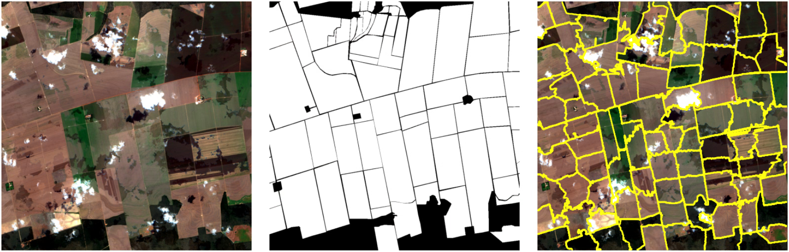

# Satellite Series Superpixels

This project implements a benchmark for superpixel generation in satellite imagery, which includes classic algorithms as well as deep models. We utilize a novel dataset produced by the Brazilian Institute of Geography and Statistics (IBGE) with annotations for the task of field boundary delineation.



## :file_folder: Data Directory Structure

> **Note**: The utilized dataset is currently not publicly available, but is planned for release via the IBGE portal later this year.

Once extracted, the dataset folder should have the following configuration:

```
data_root/
├── annotated_parcels/
│   ├── 2415008_reference_instance.tif
│   ├── 2415008_reference_valid.tif
│   └── ...
├── sentinel-2/
│   ├── 2415008_202307_s2.tif
│   ├── 2415008_202308_s2.tif
│   ├── 2415008_202309_s2.tif
│   └── ...
├── train_metadata_fold_1.json
├── val_metadata_fold_1.json
└── ...
```

## :wrench: Setup and Usage

Create a `mamba` (or `conda`) environment using the `environment.yml` file at the root of the repository to install all dependencies:

```
mamba env create -f environment.yml
```

To train and eval a model, modify or create a configuration file in the `yaml` format like in the example `configs/train_config.yaml` and run the following:

```
mamba activate sss-venv
python train_and_eval.py --config configs/train_config.yaml
```

## :bar_chart: Evaluation

Under construction :smile: